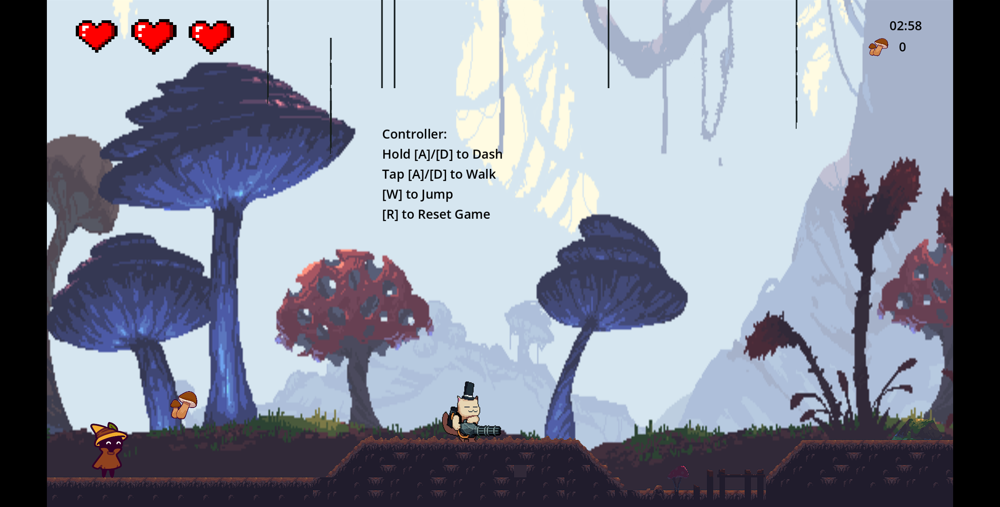
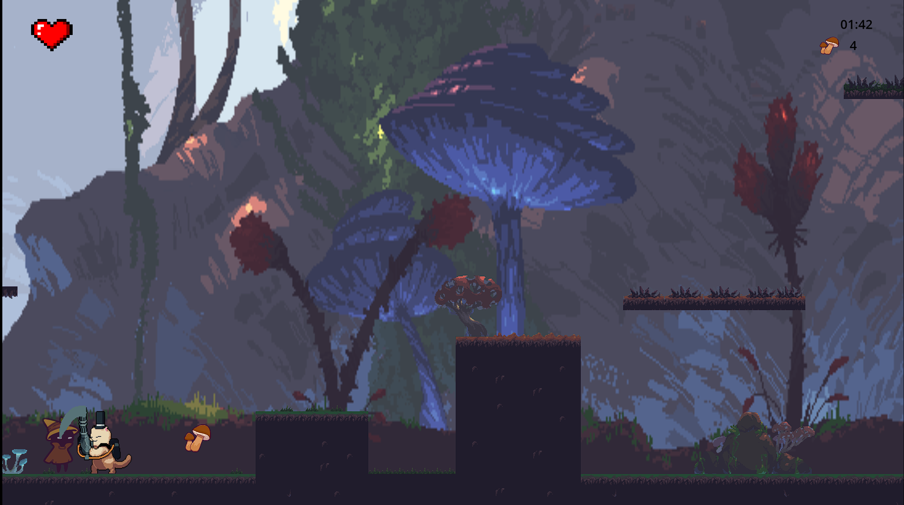

# Mushroom Dash
---

## Gameplay

- Run and jump across a side-scrolling level filled with platforms, gaps, and hazards
- Collect mushrooms scattered across the map to rack up points
- Avoid (or fight) cat enemies that patrol, detect you, and give chase
- Don't fall into the rivers — they deal damage and teleport you back
- Reach the finish line before your lives run out
- Your final score is posted to a live leaderboard

---

## Features

- Smooth platformer controls with walk → run acceleration
- Enemy AI with patrol, detection, chase, and attack states
- Horizontal and vertical moving platforms
- 3-life system with invincibility frames after taking damage
- Real-time score calculation based on mushrooms collected, lives remaining, and time left
- Online leaderboard with name submission (Flask REST API + JSON)
- Parallax scrolling background
- Animated player (idle, walk, run, jump, attack, hurt, die)
- Footstep and jump sound effects with pitch variation

---

## Tech Stack

| Layer | Tech |
|---|---|
| Game Engine | Godot 4.4 (GDScript) |
| Backend | Python / Flask |
| Communication | HTTP + JSON |

---

## Controls

| Key | Action |
|---|---|
| `A` / `D` | Move left / right |
| Hold `A` / `D` (2s) | Run |
| `W` | Jump |
| `Space` | Attack |

---

## Scoring

```
Finish line reached:  (time_left × 2) + (mushrooms × 10) + (lives × 50)
Did not finish:        (mushrooms × 10) + (lives × 50)
```

---

## How to Run

### Game

1. Download and install [Godot 4](https://godotengine.org/download)
2. Open the project folder in Godot
3. Press **F5** or click **Run Project**


### Leaderboard Backend (optional)

The leaderboard requires the Flask server to be running locally.

```bash
cd backend       # or wherever your Flask app lives
pip install flask
python app.py
```

The server runs at `https://vibhathomasgmailcom.itch.io/mushroom-chase`. Without it, gameplay still works — only score submission and leaderboard display will be unavailable.

---

## Project Structure

```
├── Scenes/
│   ├── background.tscn     # Main gameplay level
│   ├── player.tscn         # Player character
│   ├── enemy.tscn          # Cat enemy
│   ├── Mushroom.tscn       # Collectible item
│   ├── StartGame.tscn      # Main menu
│   ├── GameOver.tscn       # Game over / score screen
│   ├── LeaderboardScreen.tscn
│   └── GlobalManager.tscn  # Autoload: persistent game state + music
├── Scripts/                # GDScript files
├── assets/                 # Sprites, tilesets, audio
└── project.godot
```

---

## Screenshots




---

## What I Learned

- Structuring a Godot 4 project with autoloaded singletons for global state
- Building enemy AI state machines (patrol → chase → attack) in GDScript
- Connecting a game frontend to a REST API for persistent leaderboards
- Physics-based player movement with acceleration tiers and invincibility frames
